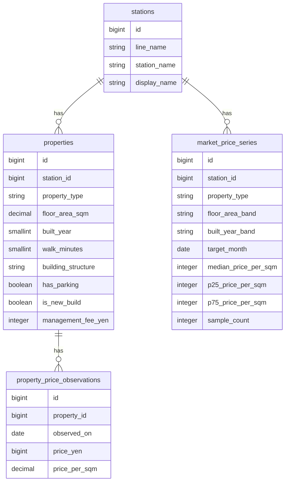

# 不動産相場可視化アプリ

駅 × 条件（面積帯 / 築年帯 / 物件種別）で
㎡単価中央値の推移を可視化するアプリケーション。

## 概要

不動産価格の「なんとなく高い・安い」ではなく、
**データに基づいた相場の把握**を目的としたアプリです。

駅単位で価格を集計し、条件ごとに分解することで、

- 相場の上昇・下降
- 条件別の価格差
- 市場の傾向

を把握できるようにします。

---

## 特徴

- 駅単位での不動産価格分析
- 面積帯・築年帯によるセグメント分析
- 生データと集計データの分離設計
- 再集計可能な構造による拡張性

---

## 技術スタック

### Backend
- Laravel 12
- PostgreSQL

### Frontend（予定）
- Next.js（TypeScript）

### インフラ
- Docker

### 開発環境
- Xdebug

### CI/CD（予定）
- GitHub Actions

---

## 現在のステータス

Phase1 開発中

### 実装済み

- Docker によるローカル環境構築
- Xdebug によるデバッグ環境構築
- 駅・物件・価格履歴・月次相場集計テーブルの設計・実装
- 物件価格から㎡単価を自動計算する処理
- 月次相場集計コマンド
- 床面積帯・築年帯による相場集計
- 集計済み相場データ取得API
- APIの任意フィルタ
    - floor_area_band
    - built_year_band
- Unitテスト
- Featureテスト

---

## API例

### リクエスト

    GET /api/market-price-series?station_id=1&property_type=mansion&floor_area_band=50_70

### レスポンス

    {
      "data": [
        {
          "target_month": "2025-01",
          "floor_area_band": "50_70",
          "built_year_band": "11_20",
          "median_price_per_sqm": 820000,
          "p25_price_per_sqm": 760000,
          "p75_price_per_sqm": 900000,
          "sample_count": 18
        }
      ]
    }

---

## 設計のポイント

### 生データと集計データの分離

#### 生データ
- properties
- property_price_observations

#### 集計データ
- market_price_series

これにより、

- 集計ロジック変更が容易
- 再集計が可能
- APIレスポンスの高速化

を実現しています。

---

## 開発における工夫

本開発では、ChatGPTやCodexなどのAIツールを活用し、設計検討やコードレビューの補助として利用しています。

ただし、AIの出力をそのまま採用するのではなく、仕様との整合性や影響範囲を自身で検証し、理解した上で実装に反映することを意識しています。
特に今回の帯分けロジックやAPI設計においては、テストコードやレビューを通じて妥当性を確認しながら改善を行いました。

AIを単なるコード生成ツールとしてではなく、「レビュー・設計補助」として活用することで、品質と理解の両立を図っています。

---

## ER図

---

## 今後の予定

- フロントエンド実装
- 相場推移グラフの表示
- APIレスポンスの改善
- CI/CD整備
- READMEへの画面キャプチャ追加

---

## 補足

※ docker-compose.yml のDB接続情報はローカル開発用のダミー値です。
本番環境では環境変数で管理する想定です。