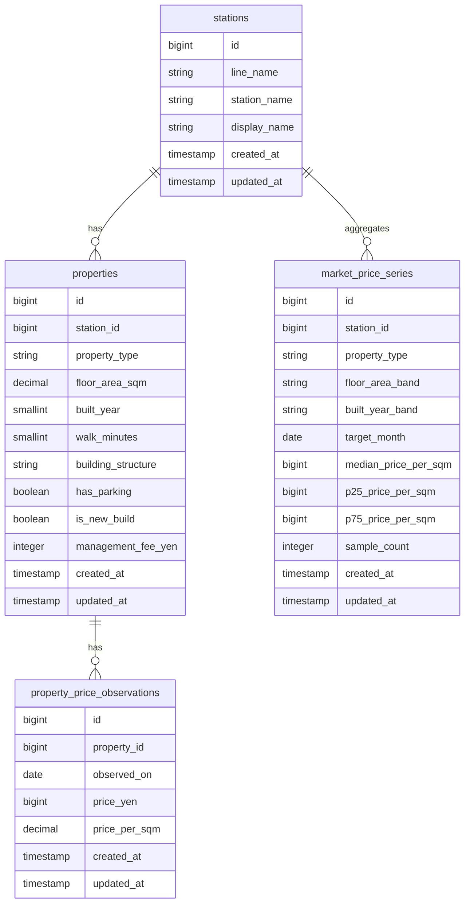

# ER図

## 補足

- `stations` は駅マスタ
- `properties` は物件の基本情報
- `property_price_observations` は物件価格の観測履歴
- `market_price_series` は駅 × 条件 × 月次の集計結果

## 設計方針

Phase1では、生データと集計データを分離する。

- 生データ
  - `properties`
  - `property_price_observations`

- 集計データ
  - `market_price_series`

これにより、将来的に条件追加や再集計、分析ロジック変更に対応しやすくする。

## 将来拡張

Phase1では、相場可視化に必要な最低限の物件属性のみを扱う。
将来的には、より条件が近い物件群の価格変動を分析出来るように、物件属性および外部指標を拡張する想定とする。

### properties に将来追加を想定する項目

以下は、物件そのものの属性として `properties` に追加する想定である。

- 土地面積
- 用途地域
- 建蔽率
- 容積率
- 所有権 / 賃借権
- 前面道路幅員
- 公道 / 私道
- 接道道路数
- 方角
- 角地
- セットバック有無
- 再建築可否

これらは特に戸建てや土地価格の形成に影響を与える要素であり、
Phase1ではスコープを絞るために除外するが、将来的には `properties` の属性として保持することで、
より類似条件の物件群を対象とした相場分析が可能になる。

### prpperties に追加済みの拡張項目

Phase1では、将来分析に向けた最小限の拡張として以下を保持する。

- `building_structure`
  - 建物構造。`wood` / `steel` / `rc`を想定する
- `has_parking`
  - 駐車場の有無
- `is_new_build`
  - 新築か中古かを表す

### 別テーブルで管理する想定の項目

以下は物件固有の属性ではなく、地域や地点、または市場全体に紐づく指標であるため、
`properties` には直接保持せず、将来的には独立したテーブルで管理する想定とする。

- 路線価
- 公示地価
- 基準地価
- 金利時系列データ

これらは年次または月次で変動しうる外部データであり、
物件属性と分離することで設計の責務を明確にし、将来的な分析拡張をしやすくする。

